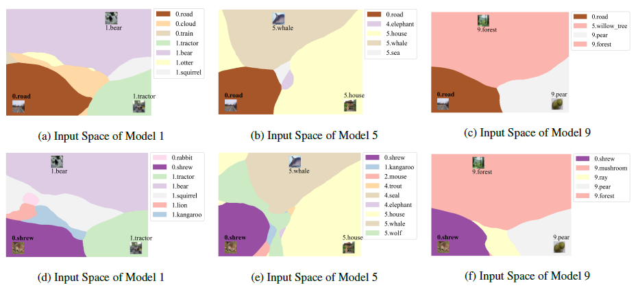

# Multi-layer Rehearsal Feature Augmentation for Class-Incremental Learning

This is the code repo for Multi-layer Rehearsal Feature Augmentation for Class-Incremental Learning (ICML 2024). 

[[paper]](https://icml.cc/virtual/2024/poster/33673)

TL; DR: We analyze the overfitting for rehearsal samples in class-incremental learning (CIL) from the perspective of all-layer margin.
We find that such margin is getting smaller and smaller during the training of CIL.
We propose the Multi-layer Rehearsal Feature Augmentation (MRFA) to enlarge the margin of the rehearsal samples during CIL.



# To Run the Code
```
python main.py --config {config_file_path}
```

# Acknowledgments

This repo uses [PyCIL](https://github.com/G-U-N/PyCIL).